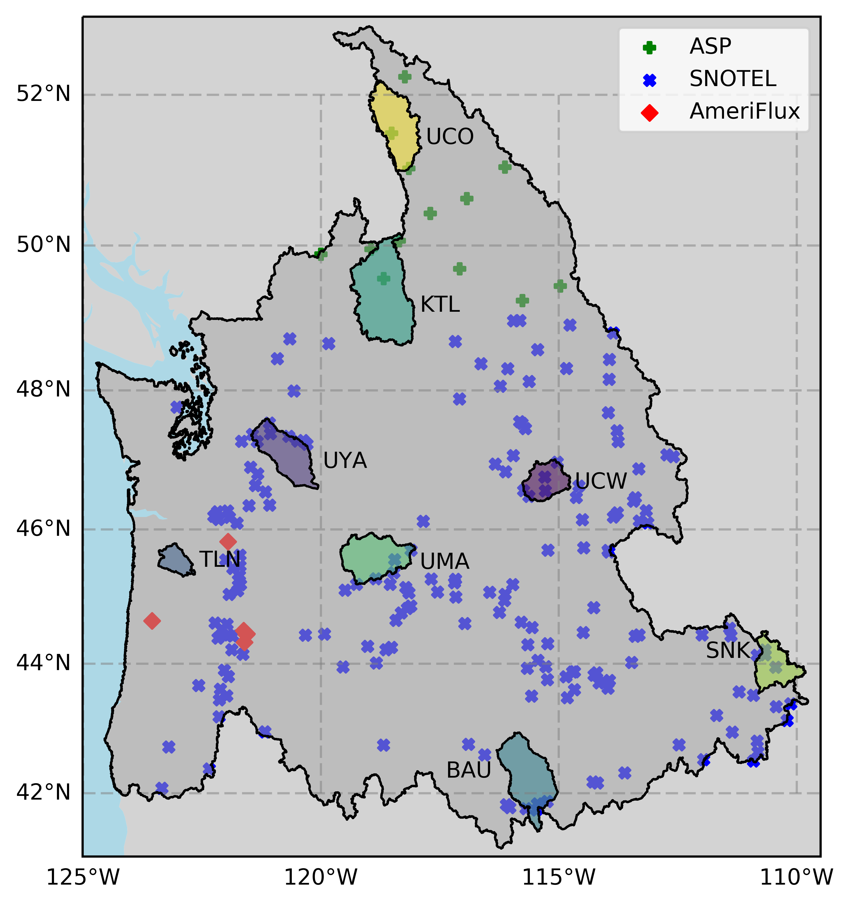
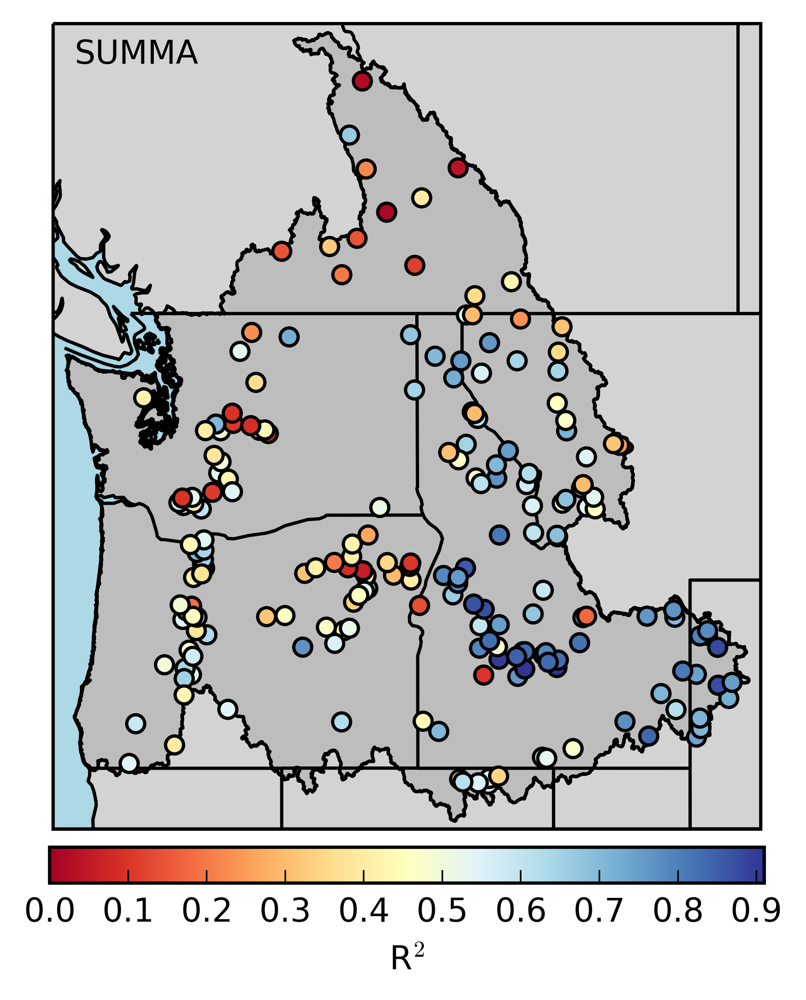
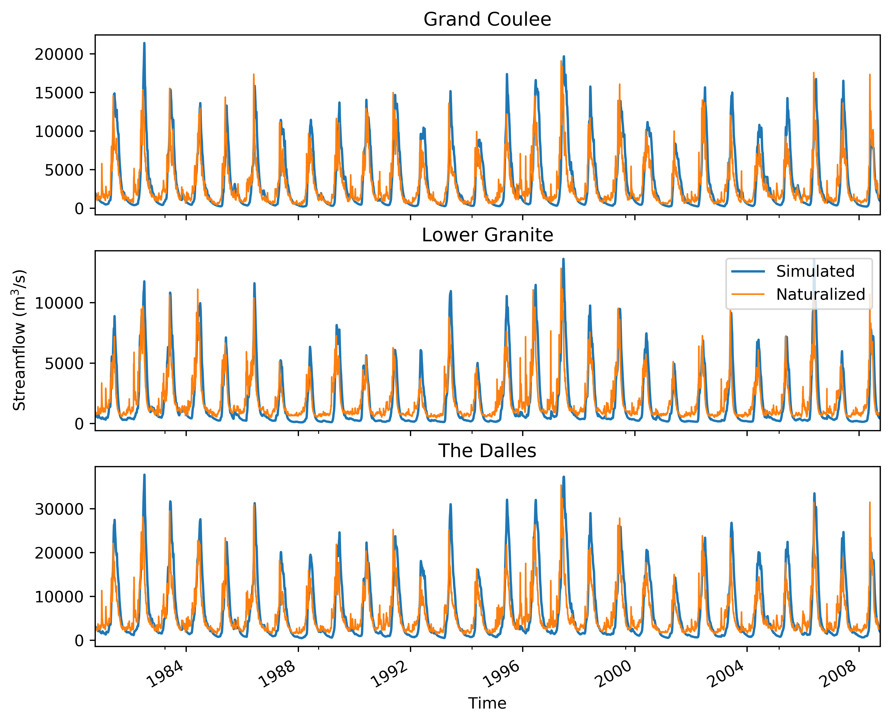
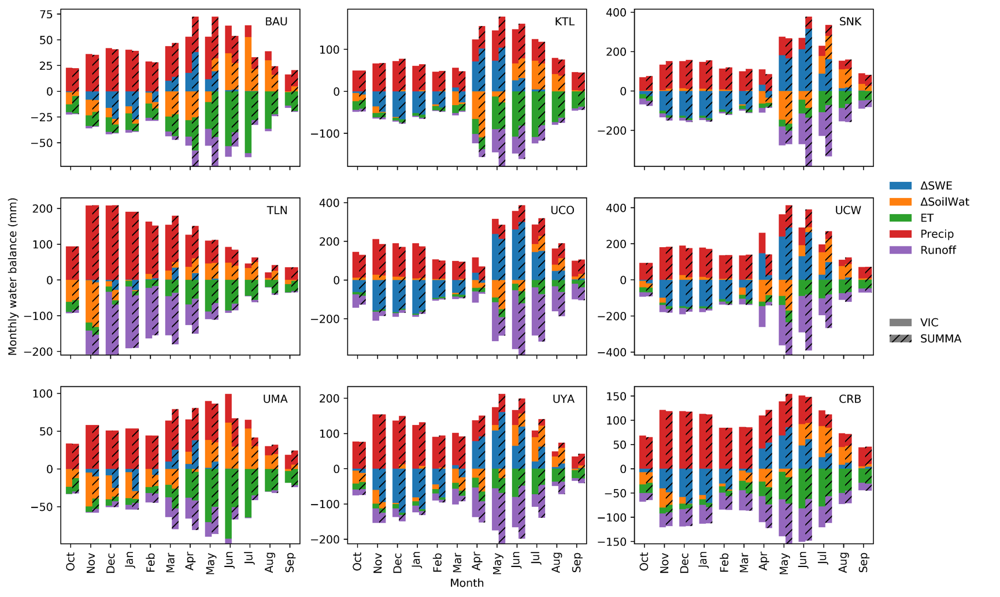

# summa_columbia_codes
    
  To use this scripts, you need to set the working directory correctly because all the files are referenced by the relative path.

`crb.py` includes some genreal functions used in other scripts.

` spatial_relation.py` analyzes the spatial relationships between observation sites and SUMMA HRUs, VIC grid cells. Also it plots all locations of the observation sites.

`snow_asp_snotel_vic_summa` handles snow outputs and compares simulated results with observations. It also make an animation showing the SWE distribution. Example plot:

    
`streamflow.py` handles streamflow data and makes streamflow plot. It also make an animation showing the monthly streamflow distribution:
 

`subbasin_hydrology_vic_summa.py` handles water balance:
 
